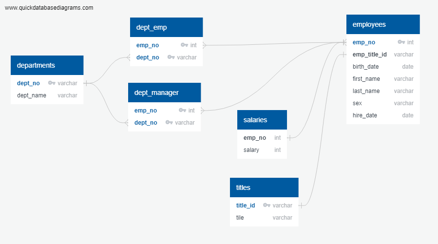

# SQL Employee Database

In this assignment, a database is designed first with an Entity Relationship Diagram. Queries then create tables in a PostgreSQL database where CSV data is import the data. Queries then answer questions about the employee data. A connection between Python and the database is then created to allow complex queries.

In other words, the assignment perform:
1. Data Engineering

3. Data Analysis

## Technologies Used
- PostgreSQL
- SQLAlchemny
- Python
- Pandas
- Numpy
- Psycopg2
- Matplotlib

## Steps Undertaken

#### Data Modeling

 Inspect the CSVs and sketch out an Entity Relationship Diagram (ERD) of the tables.
 
 .

#### Data Engineering

 * Using the ERD, create a table schema for each of the six CSV files. Specify data types, primary keys, foreign keys, and other constraints.

 * Each CSV file is then imported the corresponding SQL table.

The queries to create the tables are [here](https://github.com/tomjp90/sql-challenge/blob/main/schema.sql)

#### Data Analysis

Once the database is created, the following queries are made:

1. List the following details of each employee: employee number, last name, first name, sex, and salary.

2. List first name, last name, and hire date for employees who were hired in 1986.

3. List the manager of each department with the following information: department number, department name, the manager's employee number, last name, first name.

4. List the department of each employee with the following information: employee number, last name, first name, and department name.

5. List first name, last name, and sex for employees whose first name is "Hercules" and last names begin with "B."

6. List all employees in the Sales department, including their employee number, last name, first name, and department name.

7. List all employees in the Sales and Development departments, including their employee number, last name, first name, and department name.

8. In descending order, list the frequency count of employee last names, i.e., how many employees share each last name.

The queries are found  [here](https://github.com/tomjp90/sql-challenge/blob/main/queries.sql)

## Bonus

Use SQLAlchemy to import the SQL database into Pandas. SQLAlchemy is a library that facilitates the communication between Python programs and databases.

Analysis made:

1. A histogram to visualize the most common salary ranges for employees.

2. A bar chart of average salary by title.

The notebook is found [here](https://github.com/tomjp90/sql-challenge/blob/main/Bonus%20challange.ipynb)

